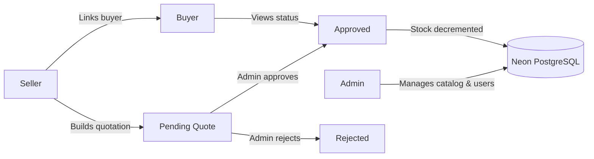

<p align="center">
  <strong style="font-size: 1.75rem;">AasaMedChem</strong><br />
  <em>Pharmaceutical Inventory &amp; Order Management System</em>
</p>

<p align="center">
  A production-oriented B2B platform for compounding catalogue management, seller-led quotations,<br />
  and admin-controlled stock allocation — built with precision units, RBAC, and a luxury-minimal UI.
</p>

<p align="center">
  <a href="https://aasa-med-chem-olive.vercel.app/">Live Demo</a>
  ·
  <a href="#quick-start">Quick Start</a>
  ·
  <a href="#documentation">Documentation</a>
  ·
  <a href="./VERCEL_AUTH.md">Deploy &amp; Auth Guide</a>
</p>

---

## Table of Contents

- [Overview](#overview)
- [Key Features](#key-features)
- [Three-Role Workflow](#three-role-workflow)
- [Architecture](#architecture)
- [Tech Stack](#tech-stack)
- [Project Structure](#project-structure)
- [Database Schema](#database-schema)
- [Unit Conversion & Pricing](#unit-conversion--pricing)
- [Authentication & RBAC](#authentication--rbac)
- [Environment Variables](#environment-variables)
- [Quick Start](#quick-start)
- [Available Scripts](#available-scripts)
- [Demo Accounts](#demo-accounts)
- [End-to-End Walkthrough](#end-to-end-walkthrough)
- [Deployment (Vercel + Neon)](#deployment-vercel--neon)
- [Troubleshooting](#troubleshooting)
- [Reflection (Assignment Notes)](#reflection-assignment-notes)
- [License](#license)

---

## Overview

**AasaMedChem** is a full-stack web application for wholesale pharmaceutical supply chains. It connects three parties — **Admin**, **Seller**, and **Buyer** — through a controlled quotation workflow where:

- Sellers browse inventory and build quotes on behalf of buyers.
- Admins review and approve or reject quotes.
- **Stock is decremented only when an admin approves** a quotation (never on cart submit).

The UI uses a **warm stone / charcoal / bronze** design system with per-role accent colors, dark mode, and responsive dashboards. The codebase is **TypeScript** end-to-end on **Next.js 16** (App Router).

| | |
|---|---|
| **Production URL** | [https://aasa-med-chem-olive.vercel.app/](https://aasa-med-chem-olive.vercel.app/) |
| **Framework** | Next.js 16.2 · React 19 · Turbopack |
| **Database** | Neon PostgreSQL (serverless) |
| **Auth** | NextAuth.js v5 (Auth.js) — credentials + JWT |

---

## Key Features

### Platform-wide

- Role-based access control (RBAC) with route protection via **`src/proxy.ts`** (Next.js 16 proxy convention)
- JWT sessions with role embedded in token (`admin` \| `seller` \| `buyer`)
- Unit-safe pricing: grams, milliliters, and count units with kg/L conversion at checkout
- `decimal.js` + PostgreSQL `NUMERIC(20,6)` — no floating-point money errors
- Audit logging, in-app notifications, quotation comments
- PDF invoice generation, CSV product import, optional S3 uploads & SendGrid email hooks
- Recharts dashboards, low-stock alerts, order status tracking

### By role

| Admin | Seller | Buyer |
|-------|--------|-------|
| Product & category CRUD | Browse catalogue & cart | View own quotations |
| Stock management & history | Submit quotes for linked buyers | Read-only order details |
| Approve / reject quotations | Manage personal listings | Dashboard metrics |
| User management | Quotation history | Product browse (read-only) |
| Audit log viewer | Performance insights | — |
| Analytics dashboard | — | — |

---

## Three-Role Workflow



**Rules that matter**

1. Only **Sellers** create quotations (with a selected buyer).
2. Only **Admins** can approve — approval triggers inventory deduction.
3. **Buyers** cannot edit catalog, cart, or quotes; they only view their own data.

---

## Architecture

The application is a **monolithic Next.js deployment**: UI, API routes, and auth live in one repo and deploy together to Vercel.

```text
┌─────────────────────────────────────────────────────────────┐
│                     Browser (React 19)                       │
│  Landing · Login · Admin / Seller / Buyer dashboards         │
└───────────────────────────┬─────────────────────────────────┘
                            │
┌───────────────────────────▼─────────────────────────────────┐
│              Next.js 16 App Router (Vercel)                    │
│  ┌─────────────┐  ┌──────────────┐  ┌─────────────────────┐  │
│  │ Server      │  │ Route        │  │ src/proxy.ts        │  │
│  │ Components  │  │ Handlers     │  │ (auth redirects,    │  │
│  │ + auth()    │  │ /api/*       │  │  RBAC enforcement)  │  │
│  └─────────────┘  └──────────────┘  └─────────────────────┘  │
│  ┌─────────────────────────────────────────────────────────┐  │
│  │ NextAuth v5  →  JWT  →  bcrypt password verify         │  │
│  └─────────────────────────────────────────────────────────┘  │
└───────────────────────────┬─────────────────────────────────┘
                            │ DATABASE_URL (SSL)
┌───────────────────────────▼─────────────────────────────────┐
│  Neon PostgreSQL  ←  Drizzle ORM  ←  @neondatabase/serverless │
└─────────────────────────────────────────────────────────────┘
```

**Request flow (login example)**

1. User submits credentials on `/login` → `signIn('credentials')`.
2. NextAuth `authorize()` loads user from Neon, compares password with **bcrypt**.
3. JWT cookie is set; client redirects to role dashboard.
4. `src/proxy.ts` reads JWT on each matched route and blocks cross-role access.
5. Layouts call `auth()` again as a server-side safety net.

---

## Tech Stack

| Layer | Technology | Purpose |
|-------|------------|---------|
| **Frontend** | Next.js 16, React 19, Tailwind CSS v4 | Pages, layouts, styling |
| **Fonts** | Playfair Display, Inter (`next/font`) | Luxury headings + UI body |
| **Backend** | Next.js Route Handlers | REST-style `/api/*` endpoints |
| **Auth** | NextAuth.js v5 (Auth.js) | Credentials provider, JWT sessions |
| **Database** | Neon PostgreSQL | Serverless Postgres |
| **ORM** | Drizzle ORM + drizzle-kit | Schema, queries, migrations push |
| **Driver** | `@neondatabase/serverless` | HTTP SQL from serverless functions |
| **Math** | `decimal.js` | Currency & unit calculations |
| **Charts** | Recharts | Admin / seller dashboards |
| **PDF** | `@react-pdf/renderer` | Printable quotations |
| **Deploy** | Vercel | Hosting + serverless functions |

---

## Project Structure

```text
AasaMedChem/
├── src/
│   ├── app/                    # App Router pages & API routes
│   │   ├── (auth)/login/       # Sign-in page
│   │   ├── admin/              # Admin console (products, quotes, users…)
│   │   ├── seller/             # Seller console (cart, listings, quotes…)
│   │   ├── buyer/              # Buyer portal (read-only orders)
│   │   ├── register/seller/    # Seller self-registration
│   │   ├── api/                # Route handlers (products, quotations, auth…)
│   │   ├── globals.css         # Design tokens & themes
│   │   ├── layout.tsx          # Root layout + providers
│   │   └── page.tsx            # Public landing page
│   ├── components/             # Shared UI (Sidebar, ProductCard, charts…)
│   ├── lib/
│   │   ├── db.ts               # Drizzle + Neon client
│   │   ├── schema.ts           # PostgreSQL table definitions
│   │   ├── units.ts            # g/kg/mL/L conversion helpers
│   │   ├── audit.ts            # Audit log helper
│   │   └── auth-redirect.ts    # Role → dashboard path
│   ├── proxy.ts                # Route protection (Next.js 16 proxy)
│   ├── auth.ts                 # NextAuth configuration
│   ├── scripts/seed.ts         # Database seed script
│   └── types/                  # TypeScript declarations (e.g. next-auth)
├── drizzle.config.ts
├── .env.example
├── VERCEL_AUTH.md              # Production auth checklist
└── package.json
```

---

## Database Schema

All tables are defined in [`src/lib/schema.ts`](./src/lib/schema.ts). Schema is synced with:

```bash
npm run db:push
```

### Core tables

<details>
<summary><strong>users</strong> — accounts & roles</summary>

| Column | Type | Notes |
|--------|------|-------|
| `id` | UUID | Primary key |
| `email` | TEXT | Unique login |
| `password_hash` | TEXT | bcrypt hash |
| `role` | TEXT | `admin` \| `seller` \| `buyer` |
| `name`, `phone`, `company_name` | TEXT | Profile |
| `business_info` | TEXT | JSON metadata (sellers) |
| `seller_id` | UUID | Buyer → assigned seller |
| `is_suspended` | BOOLEAN | Blocks login when true |

</details>

<details>
<summary><strong>products</strong> — catalogue & inventory</summary>

| Column | Type | Notes |
|--------|------|-------|
| `base_unit` | TEXT | `g` \| `mL` \| `unit` (storage unit) |
| `base_price_per_unit` | NUMERIC(20,6) | Price per 1 base unit (INR) |
| `stock_quantity` | NUMERIC(20,6) | Stock in base units |
| `low_stock_threshold` | NUMERIC(20,6) | Alert threshold |
| `category_id` | UUID | Optional FK to `categories` |
| `seller_id` | UUID | Optional seller-owned listing |

</details>

<details>
<summary><strong>quotations</strong> & <strong>quotation_items</strong></summary>

**quotations:** `seller_id`, `buyer_id`, `status` (`pending` \| `approved` \| `rejected`), `order_status` (fulfillment pipeline), `total_amount`, `notes`, `expires_at`.

**quotation_items:** line-level `ordered_unit`, `ordered_quantity`, `base_quantity` (normalized), `unit_price_at_order`, `line_total`.

</details>

<details>
<summary><strong>Supporting tables</strong></summary>

- **categories** — managed product categories  
- **stock_history_logs** — every stock change with reason  
- **audit_logs** — admin actions (JSON `details`)  
- **notifications** — per-user alerts  
- **quotation_comments** — threaded discussion on quotes  

</details>

---

## Unit Conversion & Pricing

Inventory is always stored in the **smallest base unit**:

| Dimension | Base unit | Display units |
|-----------|-----------|---------------|
| Weight | **g** | g, kg (×1000) |
| Volume | **mL** | mL, L (×1000) |
| Count | **unit** | unit |

Constants and helpers live in [`src/lib/units.ts`](./src/lib/units.ts):

```ts
export const UNIT_DIMENSIONS = {
  g:    { dimension: 'weight',  toBase: 1 },
  kg:   { dimension: 'weight',  toBase: 1000 },
  mL:   { dimension: 'volume',  toBase: 1 },
  L:    { dimension: 'volume',  toBase: 1000 },
  unit: { dimension: 'count',   toBase: 1 },
};
```

### Worked example

| Step | Value |
|------|-------|
| Product | Paracetamol powder — **₹0.05 / g** |
| Seller orders | **10 kg** |
| `base_quantity` | 10 × 1,000 = **10,000 g** (stored in DB) |
| `unit_price_at_order` | ₹0.05 × 1,000 = **₹50.00 / kg** (snapshot) |
| `line_total` | 10 × ₹50.00 = **₹500.00** |

> JavaScript floats are never used for money in critical paths — use **`decimal.js`** and DB `NUMERIC` types.

---

## Authentication & RBAC

### How it works

1. **NextAuth.js v5** with a **Credentials** provider ([`src/auth.ts`](./src/auth.ts)).
2. On login, email/password are checked against `users`; password verified with **bcryptjs**.
3. Session strategy is **JWT** — payload includes `id`, `email`, `name`, and **`role`**.
4. **`src/proxy.ts`** (Next.js 16) runs before matched routes:
   - Logged-in users hitting `/` or `/login` → redirected to their dashboard.
   - Guests hitting `/admin/*`, `/seller/*`, `/buyer/*` → sent to `/login`.
   - Wrong role for a prefix → redirected to login.
5. **Layouts** (`admin/layout.tsx`, etc.) call `auth()` and `redirect('/login')` if the session role does not match.

### Role → dashboard

| Role | Dashboard URL |
|------|----------------|
| `admin` | `/admin/dashboard` |
| `seller` | `/seller/dashboard` |
| `buyer` | `/buyer/dashboard` |

### UI themes (accent colors)

| Role | Theme class | Accent |
|------|-------------|--------|
| Admin | `.theme-admin` | Bronze / gold |
| Seller | `.theme-seller` | Navy / sapphire blue |
| Buyer | `.theme-buyer` | Slate (neutral) |

> **Important:** Do not add `src/middleware.ts` that re-exports from `proxy.ts` — Next.js 16 expects a single **`src/proxy.ts`** file. See [VERCEL_AUTH.md](./VERCEL_AUTH.md) for production cookie and env var details.

---

## Environment Variables

Copy [`.env.example`](./.env.example) to `.env`:

```bash
cp .env.example .env
```

| Variable | Required | Description |
|----------|----------|-------------|
| `DATABASE_URL` | Yes | Neon connection string with `?sslmode=require` |
| `AUTH_SECRET` | Yes | Random secret (32+ chars); same as below |
| `NEXTAUTH_SECRET` | Yes | Same value as `AUTH_SECRET` |
| `AUTH_URL` | Yes | App URL — `http://localhost:3000` locally |
| `NEXTAUTH_URL` | Yes | Same as `AUTH_URL` |
| `AWS_*`, `SENDGRID_*` | No | Optional file upload & email |

Generate a secret:

```bash
openssl rand -base64 32
```

---

## Quick Start

### Prerequisites

- **Node.js 20.6+** (for `node --env-file`)
- A **Neon** project ([neon.tech](https://neon.tech)) or compatible PostgreSQL

### Install & run

```bash
git clone <your-repo-url>
cd AasaMedChem
npm install
cp .env.example .env          # edit DATABASE_URL + auth secrets
npm run db:push               # sync schema to Neon
npm run db:seed               # demo users, products, sample quotes
npm run dev
```

Open **[http://localhost:3000](http://localhost:3000)** — landing page  
Open **[http://localhost:3000/login](http://localhost:3000/login)** — sign in

### Production build (local check)

```bash
npm run build
npm start
```

---

## Available Scripts

| Command | Description |
|---------|-------------|
| `npm run dev` | Start development server (Turbopack) |
| `npm run build` | Production build + type check |
| `npm run start` | Run production server |
| `npm run lint` | ESLint (Next.js config) |
| `npm run db:push` | Push Drizzle schema to database |
| `npm run db:seed` | Reset & seed demo data (**destructive** on seed tables) |

---

## Demo Accounts

Created by `npm run db:seed`:

| Role | Email | Password | Notes |
|------|-------|----------|-------|
| **Admin** | `admin@aasa.com` | `admin123` | Full system control |
| **Seller** | `seller@aasa.com` | `seller123` | Rahul Sharma — default agent |
| **Buyer 1** | `buyer@aasa.com` | `buyer123` | Apollo Pharmacy Delhi |
| **Buyer 2** | `buyer2@aasa.com` | `buyer123` | MedPlus Pharmacy |

> Use only in development / demo environments. Change passwords before any real deployment.

---

## End-to-End Walkthrough

Verify the full quotation lifecycle in ~10 minutes:

### 1 — Admin: verify stock

1. Sign in as **admin@aasa.com** / `admin123`.
2. Go to **Products** → confirm **Paracetamol Powder** shows ~`100,000 g` stock at ₹0.05/g.
3. Sign out.

### 2 — Seller: build & submit quote

1. Sign in as **seller@aasa.com** / `seller123`.
2. **Browse Products** → Paracetamol → quantity **10**, unit **kg** → **Add to Cart**.
3. Open **Active Cart** → select **Apollo Pharmacy (Buyer 1)**.
4. Add notes → **Submit Quotation** → sign out.

### 3 — Admin: approve & allocate stock

1. Sign in as admin → **Quotations** → open pending quote.
2. Review line: 10 kg → 10,000 g base, ₹500 total.
3. Click **Approve & Allocate Stock**.
4. **Products** → stock should drop by 10,000 g (~90,000 g remaining).

### 4 — Buyer: view order

1. Sign in as **buyer@aasa.com** / `buyer123`.
2. Dashboard shows approved value **₹500.00**.
3. **My Orders/Quotations** → view read-only breakdown.

---

## Deployment (Vercel + Neon)

### Checklist

1. Push code to GitHub and import the repo in [Vercel](https://vercel.com).
2. Add environment variables (see [VERCEL_AUTH.md](./VERCEL_AUTH.md)):
   - `DATABASE_URL`, `AUTH_SECRET`, `NEXTAUTH_SECRET`, `AUTH_URL`, `NEXTAUTH_URL`
   - Production URL example: `https://aasa-med-chem-olive.vercel.app` (**no trailing slash**)
3. Deploy, then **seed the same Neon database** Vercel uses:

   ```bash
   # Point .env DATABASE_URL at production Neon temporarily:
   npm run db:push
   npm run db:seed
   ```

4. Redeploy after changing secrets or URLs.
5. Test login — cookie `authjs.session-token` should appear in DevTools.

### Common production mistake

Connecting to Neon **does not** create users. If `SELECT email, role FROM users;` returns zero rows, every login will fail or bounce to the landing page.

---

## Troubleshooting

| Symptom | Likely cause | Fix |
|---------|--------------|-----|
| Login succeeds but shows landing page | Missing seed / proxy not running | Run `db:seed`; ensure only `src/proxy.ts` exists (no broken `middleware.ts`) |
| `Invalid credentials` | Wrong DB or no users | Seed DB; verify email/password |
| Build: `@import` CSS error | Font import after Tailwind | Use `next/font` only — see `globals.css` |
| `Can't recognize exported config` | `middleware.ts` re-exports `config` | Delete `src/middleware.ts`; use `src/proxy.ts` |
| DB error on startup | Missing `DATABASE_URL` | Create `.env` from `.env.example` |
| Port 3000 in use | Another `next dev` running | Stop old process or use shown port (3001) |

---

## Reflection (Assignment Notes)

### Overall architecture

This is a **Next.js 16 monolith**: React UI and server logic share one codebase deployed to Vercel. **Neon PostgreSQL** holds all state; **Drizzle ORM** with the Neon serverless driver connects via `DATABASE_URL`. Auth is **NextAuth v5** (JWT + credentials). Supporting libraries include **bcryptjs**, **decimal.js**, **Recharts**, and **Tailwind CSS v4**.

### Authentication & role separation

Authentication uses **email/password** checked with bcrypt; the JWT stores **`role`**. **`src/proxy.ts`** enforces which routes each role can hit; layouts double-check with `auth()`. Admins manage catalog and approvals; sellers create quotations for assigned buyers; buyers have read-only access to their own orders.

### Database connection

`src/lib/db.ts` reads `process.env.DATABASE_URL`, creates a `@neondatabase/serverless` client, and wraps it with `drizzle(sql, { schema })`. Schema lives in `src/lib/schema.ts`; `npm run db:push` syncs to Neon; `npm run db:seed` loads demo data.

### If traffic increased 10×

Improve the **database layer first**: Neon connection pooling, indexes on hot columns (`users.email`, `quotations.status`, foreign keys), and pagination on list/dashboard queries. Most requests are DB-bound before the UI becomes the bottleneck.

### Commit strategy

Small, focused commits per feature or fix (auth, schema, UI theme) with messages that explain **why**, not only **what**. Secrets stay in `.env` / Vercel — never committed.

### One more day of work

Add **automated tests** for login RBAC and the approve → stock-decrement path, and enable **strict TypeScript** in CI — those flows are easy to break without regression coverage.

### Most challenging part

**Auth on Vercel**: aligning JWT cookies (`secureCookie`), env vars (`AUTH_URL`), proxy redirects, and seeding the **production** Neon instance separately from local — debugging by separating “login API 200” vs “session visible to proxy.”

---

## License

This project was built as an academic / portfolio assignment. Add your license here if you open-source it (e.g. MIT).

---

<p align="center">
  <sub>© 2026 AasaMedChem · Pharmaceutical Supply Chain OS</sub>
</p>
